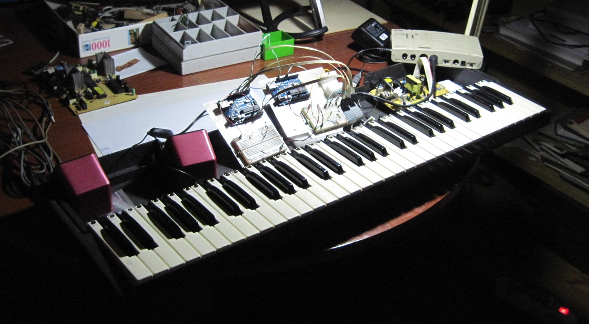

= README.adoc 
:lang: it
:author: Tiziano
v0.4, 05-feb-2017

== Progetto di un Sintetizzatore OpenHardware

MastroPiano è un progetto Open Hardware che si propone di realizzare strumenti 
musicali, prevalentemente tastiere e moduli sonori e di controllo MIDI, 
impiegando Software Libero, dispositivi e componenti elettronici e materiali di 
recupero facilmente reperibili. 

Per costruire uno strumento musicale elettronico servono diversi componenti 
elettromeccanici. In primo luogo la tastiera, i circuiti di controllo dei tasti,  
i moduli di controllo e di generazione del suono. 

Per quanto riguarda quest'ultimo aspetto, della sintesi audio, che rappresenta 
la componente più complessa e delicata del sistema, ci si propone di 
sperimentare diversi approcci in ordine crescente di difficoltà e di resa 
qualitativa. Questo per rispettare il più possibile il vincolo principale del 
progetto che richiede l'impiego di componenti che siano di facile costruzione e 
applicazione. 

Uno strumento Musicale elettronico è un’apparecchiatura, caratterizzata da una 
componentistica sofisticata che oggi può essere realizzata impiegando 
dispositivi digitali a microprocessore molto più accessibili, unitamente al 
software, che sostituisce drasticamente l’impiego dei circuiti logici cablati e 
analogici più critici. 

Questa è la pagina di presentazione dello spazio github riservato a 
'mastroPiano' che comprende i sorgenti del software, gli schemi elettrici e la 
documentazione che illustra i concetti e le modalità per la sperimentazione e 
l'applicazione pratica. Per capire in dettaglio gli aspetti tecnici dei 
componenti in gioco, consultare le pagine relative alla 
link:https://tizziano.github.io/mastropiano[Documentazione]. 

// sbagliato link:docs/index.html[pagina principale]
